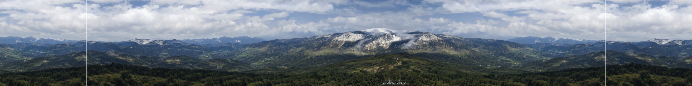

# Anyres-GAN
[Project Page](https://chail.github.io/anyres-gan/) | [Paper](https://arxiv.org/abs/2204.07156) | [Bibtex](https://chail.github.io/anyres-gan/bibtex.txt)

Any-resolution Training for High-resolution Image Synthesis.\
[Lucy Chai](http://people.csail.mit.edu/lrchai/), [Michaël Gharbi](http://mgharbi.com/), [Eli Shechtman](https://research.adobe.com/person/eli-shechtman/), [Phillip Isola](http://web.mit.edu/phillipi/), [Richard Zhang](https://richzhang.github.io/)

*Code will be coming soon!*

